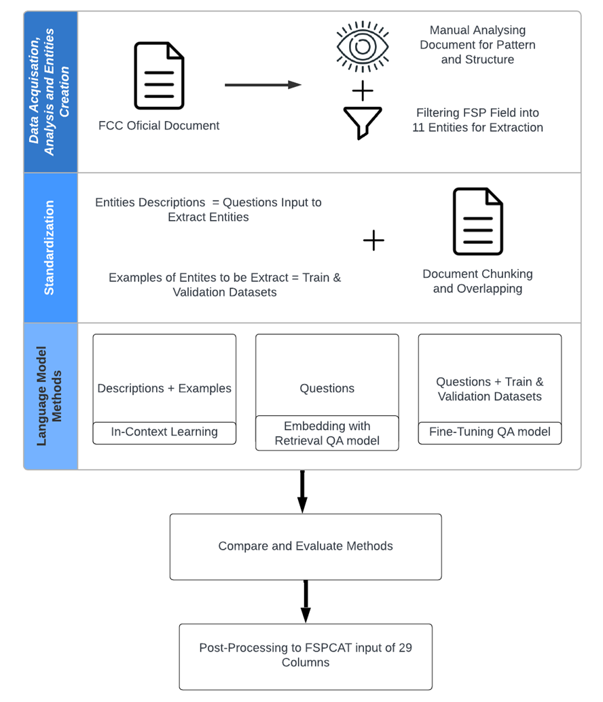
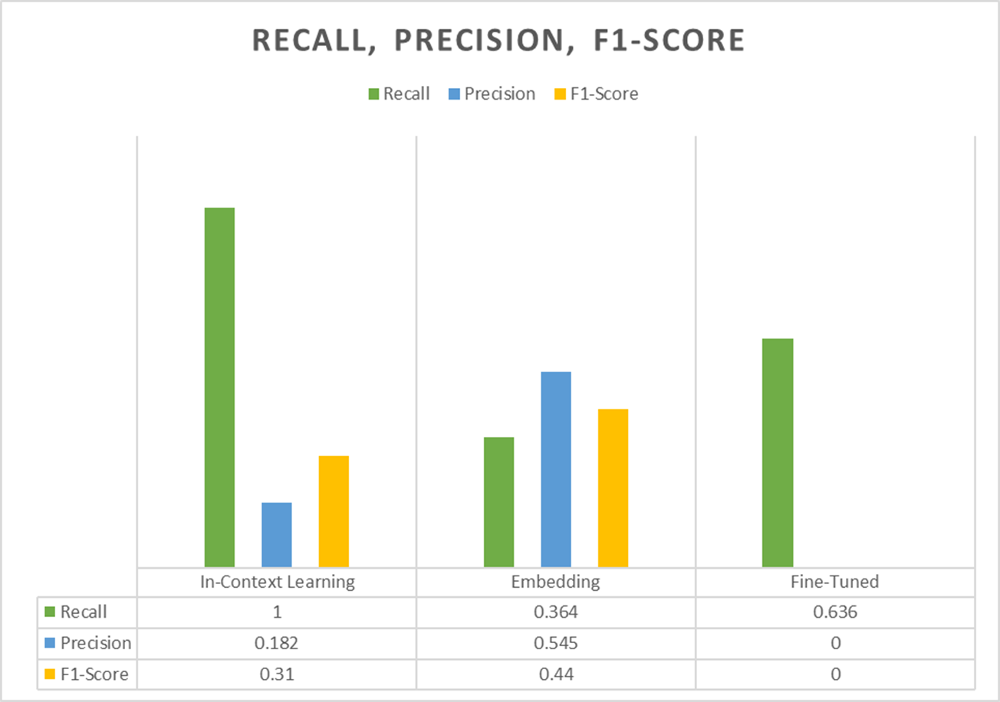

# Information Extraction

 Title: **Leveraging Language Models for Information Extraction of Entities in Orbital Environment Evolution**
 
 **Table of Content**
 1. [Abstract](https://github.com/AlinZohari/InformationExtraction?tab=readme-ov-file#abstract)
 2. [Entities and its description](https://github.com/AlinZohari/InformationExtraction?tab=readme-ov-file#entities-and-description)
 3. [Dependencies](https://github.com/AlinZohari/InformationExtraction?tab=readme-ov-file#dependencies)
 4. [Methodology Steps](https://github.com/AlinZohari/InformationExtraction?tab=readme-ov-file#methodology-steps)
 5. [Methods](https://github.com/AlinZohari/InformationExtraction?tab=readme-ov-file#methods)
 6. [Results](https://github.com/AlinZohari/InformationExtraction?tab=readme-ov-file#results)
    
## Abstract
Emerging commercial models, stakeholders, and technologies are driving a diverse range of advanced mega satellites constellation services. Major players are competitively launching Fixed Satellite System (FSS), mainly in Low Earth Orbit (LEO). This mega constellation comprise of hundreds and thousands satellites.
Research into the evolution of the orbital environment has been conducted to illustrate how the distribution of satellites changes over time. Visualizing this orbital environment evolution and conducting conjunction analyses serves as a means of democratizing this information, making it accessible for the public, scientific community, and regulatory bodies. 
Official authorized documents from regulatory bodies like the FCC (Federal Communication Commissions) play a pivotal role in predicting space population and orbital environment. However, Manual extraction of information is labor-intensive, making it suitable for Information Extraction (IE) tasks, a field in Natural Language Processing (NLP).

This project is designed with the objective of locating and extracting a total of **11 granted orbital environment entities** from unstructured FCC documents. These entities consist of one proper noun entity, referred to as 'constellationName,' three date entities, and seven entities represented by integers or floating-point numbers.
The project will explore 3 methods or approaches in leveraging language model which are **In-Context Learning with Large Language Models (LLMs)**, **Embedding with Retrieval QA (Question Answer) model** and **Fine Tuning QA (Question Answer) model**. The results of each method are organized into two tables: one that calculates recall, encompassing all possible values of proposed and granted entities, and another that calculates precision, specifically focusing on granted entities only

In the evaluation of different methods, **In-Context Learning** emerges as the leader in recall, effectively capturing all types of entities, both granted and proposed. Its strength lies in its capacity to obtained insights from descriptions and examples, allowing it to comprehensively extract information. On the other hand, **Embedding** stands out for its exceptional precision. It achieves this by tailoring its inquiries to identify only 'authorized' or 'granted' entities and subsequently gauging their relevance through cosine similarity calculations with the embedded document. However, **Fine-Tuning** falls short in the assessment, registering a precision score of 0. The primary reasons for this underperformance are the limitations of the training and validation datasets, consisting of just 42 and 11 IDs, respectively. Additionally, overfitting compounds the challenges faced by the Fine-Tuning approach

### Entities and Description
| No. | Entities | Description |
| --------------- | --------------- | --------------- |
| 1    | constellationName    | The satellite constellation name for which the company applied to deploy or operate    |
| 2   | dateRelease    | The date the document release     |
| 3   | date50    | The date when the company is order to launch and operate 50 percent of its satellites     |
| 4   | date100   | The date when the company is order to completely launch and operate all of its remaining satellites     |
| 5    | totalSatelliteNumber     | The concluding total number of satellites that the company has been authorized to deploy and operate for the constellation     |
| 6    | altitudes    | The granted altitudes of the satellites that the company has been authorized to deploy    |
| 7    | inclination     | The granted inclination of the satellites that the company has been authorized to deploy, respective to the altitudes     |
| 8    | numberOrbPlane     | The number of orbital planes, respective to the altitudes and inclination, that the company has been authorized to deploy     |
| 9    | totalSatellitePerOrbPlane     | The specific count of satellites located in each individual orbital plane. This count refers to the total number of satellites within one orbital plane, and it can vary from plane to plane based on the altitudes and inclination    |
| 10   | totalSatellitePerAltIncl   | The total number of satellites at a specific altitude and inclination across all orbital planes sharing these characteristics. This count represents the overall number of satellites with the specified altitude and inclination parameters   |
| 11   | operationalLifetime   | The operational lifetime of the satellite in the constellation in years    |

## Dependencies

- [huggingface-hub](https://github.com/huggingface/huggingface_hub) (v0.16.4)
- [kor](https://github.com/lilohuang/Kor) (v0.13.0)
- [langchain](https://github.com/langchain/langchain) (v0.0.245)
- [NumPy](https://numpy.org/) (v1.24.4)
- [openai](https://github.com/openai/openai) (v0.27.8)
- [Pandas](https://pandas.pydata.org/) (v1.5.3)
- [Pydantic](https://pydantic-docs.helpmanual.io/) (v1.10.11)
- [regex](https://github.com/python/regex) (v2023.6.3)
- [scikit-learn](https://scikit-learn.org/stable/) (v1.3.0)
- [simpletransformers](https://github.com/ThilinaRajapakse/simpletransformers) (v0.64.3)
- [spaCy](https://spacy.io/) (v3.6.0)
- [transformers](https://github.com/huggingface/transformers) (v4.31.0)

## Methodology Steps

## Methods
### In-Context Learning
1. [Notebook](https://github.com/AlinZohari/InformationExtraction/blob/main/001_InContext_Learning.ipynb)

2. [Output - XLSX Dataframe](https://github.com/AlinZohari/InformationExtraction/blob/main/001_InContext_Learning.ipynb)

3. [Output - JSON Starlink Gen2](https://github.com/AlinZohari/InformationExtraction/blob/main/output/Gen2_Starlink_gpt-3.5-turbo_data.json)

### Embedding with Retrieval QA model
1. [Notebook](https://github.com/AlinZohari/InformationExtraction/blob/main/002_Embedding.ipynb)

2. [Output - XLSX Dataframe](https://github.com/AlinZohari/InformationExtraction/blob/main/output/embedding_gen2_results.xlsx)

### Fine Tuning QA model
1. [Notebook](https://github.com/AlinZohari/InformationExtraction/blob/main/003_SQuAD_TuneQAmodel.ipynb)

2. [Output - XLSX Dataframe](https://github.com/AlinZohari/InformationExtraction/blob/main/output/tuned_gen2.xlsx)

3. [Output -Tuned Model (Link Google Drive)](https://drive.google.com/drive/folders/16RcXBTkrHYmvM0Xu4-X0b8mMT-LyJHN8?usp=sharing)

## Results

